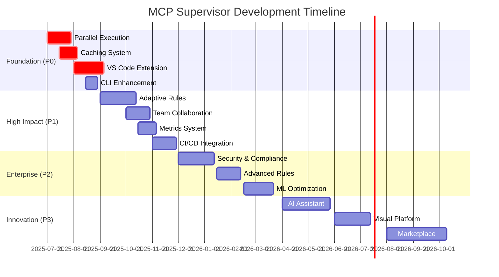

# 🎯 MCP Supervisor - Project Management & Tracking

## 📋 **Epic & Milestone Structure**

### **Year 1 Roadmap Overview**



---

## 🎯 **Epic Definitions**

### **EPIC-001: Performance & Scalability Foundation**

- **Duration**: Months 1-3 | **Priority**: P0 | **Team Size**: 3-4 developers
- **Business Value**: Essential for user adoption and production viability
- **Success Metrics**:
  - Rule execution time reduced by 70%
  - Memory usage optimized (< 512MB)
  - Cache hit ratio > 80%
  - Support for 100+ rule configurations

#### **Epic Tasks**:

- [x] **TASK-001**: Parallel Rule Execution Engine (4 weeks)
- [x] **TASK-002**: Intelligent Caching System (3 weeks)
- [ ] **TASK-003**: Performance Monitoring (2 weeks)
- [ ] **TASK-004**: Memory Optimization (2 weeks)
- [ ] **TASK-005**: Load Testing Framework (1 week)

### **EPIC-002: Developer Experience Excellence**

- **Duration**: Months 1-4 | **Priority**: P0-P1 | **Team Size**: 2-3 developers
- **Business Value**: Critical for developer adoption and daily usage
- **Success Metrics**:
  - VS Code extension: 10K+ downloads in first 6 months
  - Developer satisfaction score > 4.5/5
  - Configuration time reduced by 60%
  - Integration with 5+ popular IDEs

#### **Epic Tasks**:

- [ ] **TASK-006**: VS Code Extension MVP (5 weeks)
- [ ] **TASK-007**: CLI Enhancement (2 weeks)
- [ ] **TASK-008**: Configuration Wizard (3 weeks)
- [ ] **TASK-009**: Documentation Platform (2 weeks)
- [ ] **TASK-010**: IntelliJ Plugin (4 weeks)

### **EPIC-003: Intelligent Rule System**

- **Duration**: Months 4-8 | **Priority**: P1 | **Team Size**: 4-5 developers
- **Business Value**: Key differentiator and competitive advantage
- **Success Metrics**:
  - AI-suggested rule adjustments accuracy > 85%
  - False positive reduction by 50%
  - Rule effectiveness improvement by 40%
  - Project type detection accuracy > 90%

#### **Epic Tasks**:

- [ ] **TASK-011**: Adaptive Rule Engine (6 weeks)
- [ ] **TASK-012**: Project Analysis AI (4 weeks)
- [ ] **TASK-013**: Rule Optimization ML (5 weeks)
- [ ] **TASK-014**: Smart Dependencies (3 weeks)
- [ ] **TASK-015**: Predictive Analytics (4 weeks)

---

## 📊 **Sprint Planning Template**

### **Sprint Structure**: 2-week sprints with following ceremonies

- **Sprint Planning**: Monday Week 1 (2 hours)
- **Daily Standups**: Every day (15 minutes)
- **Sprint Review**: Friday Week 2 (1 hour)
- **Sprint Retrospective**: Friday Week 2 (1 hour)

### **Sprint Capacity Planning**

```yaml
team_capacity:
  senior_developer: 8 story_points/sprint
  mid_developer: 6 story_points/sprint
  junior_developer: 4 story_points/sprint
  tech_lead: 6 story_points/sprint (includes 25% for code review/mentoring)

story_point_scale:
  1: 'Simple bug fix, < 4 hours'
  2: 'Small feature, clear requirements, < 1 day'
  3: 'Medium feature, some complexity, 2-3 days'
  5: 'Large feature, multiple components, 1 week'
  8: 'Complex feature, research needed, 1.5-2 weeks'
  13: 'Epic-level work, needs breakdown'
```

---

## 🏷️ **GitHub Issues & Labels System**

### **Issue Templates**

#### **Feature Request Template**

```markdown
## 🚀 Feature Request

### **Epic**: [Epic Name]

### **Priority**: P0/P1/P2/P3

### **Effort Estimate**: XS/S/M/L/XL

### **Risk Level**: Low/Medium/High/Critical

### **Problem Statement**

<!-- What problem does this solve? Who benefits? -->

### **Proposed Solution**

<!-- Technical approach and implementation details -->

### **Acceptance Criteria**

- [ ] Functional requirement 1
- [ ] Performance requirement 2
- [ ] Quality requirement 3

### **Dependencies**

<!-- Other issues, external systems, or decisions needed -->

### **Definition of Done**

- [ ] Code implemented and reviewed
- [ ] Unit tests written (>90% coverage)
- [ ] Integration tests passing
- [ ] Documentation updated
- [ ] Performance benchmarks met
- [ ] Security review completed
```

#### **Bug Report Template**

```markdown
## 🐛 Bug Report

### **Severity**: Critical/High/Medium/Low

### **Component**: Core/CLI/Extension/Web

### **Environment**: Development/Staging/Production

### **Current Behavior**

<!-- What's happening now -->

### **Expected Behavior**

<!-- What should happen -->

### **Steps to Reproduce**

1. Step 1
2. Step 2
3. Step 3

### **Environment Details**

- OS:
- Node.js version:
- MCP Supervisor version:
- Configuration: [attach .supervisorrc.json]

### **Additional Context**

<!-- Screenshots, logs, related issues -->
```

### **Label System**

```yaml
priority:
  - 'priority/p0-critical' # Must fix immediately
  - 'priority/p1-high' # Important for current milestone
  - 'priority/p2-medium' # Nice to have
  - 'priority/p3-low' # Future consideration

type:
  - 'type/feature' # New functionality
  - 'type/bug' # Something is broken
  - 'type/enhancement' # Improvement to existing feature
  - 'type/refactor' # Code quality improvement
  - 'type/docs' # Documentation updates

component:
  - 'component/core' # Rule engine core
  - 'component/cli' # Command line interface
  - 'component/extension' # IDE extensions
  - 'component/web' # Web interface
  - 'component/api' # REST API
  - 'component/plugins' # Plugin system

effort:
  - 'effort/xs' # 1-3 days
  - 'effort/s' # 1 week
  - 'effort/m' # 2-3 weeks
  - 'effort/l' # 4-6 weeks
  - 'effort/xl' # 7+ weeks

status:
  - 'status/needs-triage' # Needs initial assessment
  - 'status/blocked' # Cannot proceed
  - 'status/in-progress' # Active development
  - 'status/review' # Waiting for code review
  - 'status/testing' # In QA testing
  - 'status/done' # Completed and deployed
```

---

## 📈 **Progress Tracking & Metrics**

### **Key Performance Indicators (KPIs)**

#### **Development Velocity**

```yaml
velocity_metrics:
  story_points_per_sprint:
    target: 25-30
    measurement: 'Sum of completed story points'

  cycle_time:
    target: '< 5 days from start to done'
    measurement: 'Time from In Progress to Done'

  lead_time:
    target: '< 10 days from creation to done'
    measurement: 'Time from issue creation to completion'

  bug_rate:
    target: '< 5% of completed features'
    measurement: 'Bugs reported / Features completed'
```

#### **Quality Metrics**

```yaml
quality_metrics:
  code_coverage:
    target: '> 90%'
    measurement: 'Jest/Istanbul coverage reports'

  performance_regression:
    target: '0 regressions per release'
    measurement: 'Automated performance tests'

  security_vulnerabilities:
    target: '0 high/critical severity'
    measurement: 'Snyk/OWASP dependency scan'

  documentation_coverage:
    target: '> 95% of public APIs'
    measurement: 'TSDoc coverage analysis'
```

### **Weekly Status Report Template**

```markdown
# 📊 Weekly Status Report - Week of [DATE]

## 🎯 **Sprint Goals Progress**

- [ ] Goal 1: [Progress %]
- [ ] Goal 2: [Progress %]
- [ ] Goal 3: [Progress %]

## ✅ **Completed This Week**

- **TASK-XXX**: Brief description
- **TASK-XXX**: Brief description

## 🚧 **In Progress**

- **TASK-XXX**: Current status and expected completion
- **TASK-XXX**: Current status and expected completion

## 🚨 **Blockers & Risks**

- **Blocker 1**: Description and mitigation plan
- **Risk 1**: Probability and impact assessment

## 📊 **Metrics Update**

- Story Points Completed: X/Y
- Velocity Trend: [Graph or description]
- Bug Count: X (target: <5)
- Performance: [Key metrics]

## 🎯 **Next Week Priorities**

1. Priority 1
2. Priority 2
3. Priority 3
```

---

## 🔄 **Release Management**

### **Release Schedule**

- **Minor Releases**: Every 2 weeks (feature additions, improvements)
- **Patch Releases**: As needed (bug fixes, security updates)
- **Major Releases**: Quarterly (breaking changes, major features)

### **Release Checklist**

```markdown
## 🚀 Release Checklist - v[VERSION]

### **Pre-Release**

- [ ] All planned features completed
- [ ] Performance benchmarks passed
- [ ] Security scan completed (0 high/critical issues)
- [ ] Documentation updated
- [ ] Migration guide written (if breaking changes)
- [ ] Changelog prepared

### **Testing**

- [ ] Unit tests passing (>90% coverage)
- [ ] Integration tests passing
- [ ] Performance tests passing
- [ ] User acceptance testing completed
- [ ] Beta testing feedback incorporated

### **Release**

- [ ] Version tagged in Git
- [ ] Packages published to npm
- [ ] VS Code extension published
- [ ] Docker images built and pushed
- [ ] Release notes published
- [ ] Documentation deployed

### **Post-Release**

- [ ] Release announcement posted
- [ ] Monitoring dashboards updated
- [ ] Support team notified
- [ ] Community feedback collected
- [ ] Post-mortem scheduled (if issues)
```

This comprehensive project management system ensures systematic tracking, clear communication, and measurable progress toward the MCP Supervisor vision.
